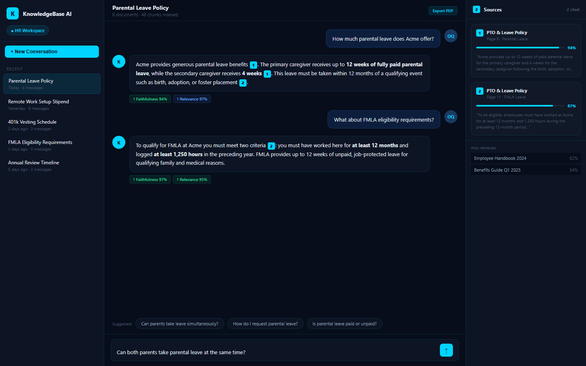
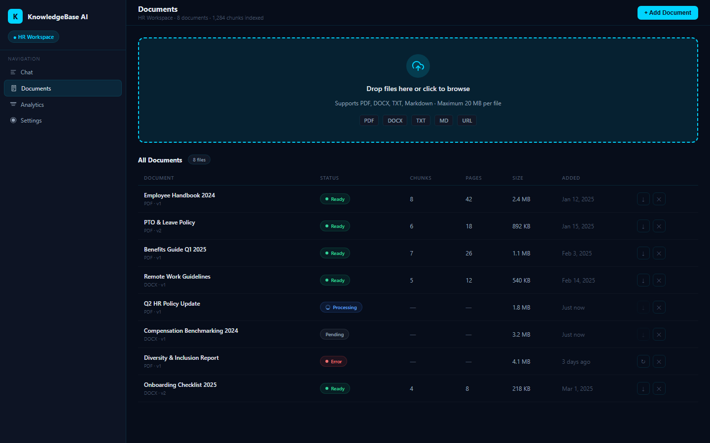
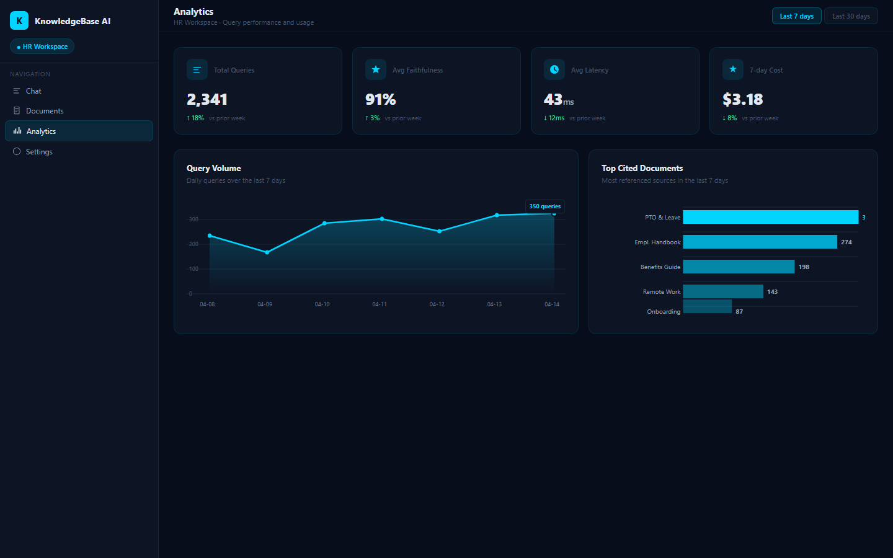
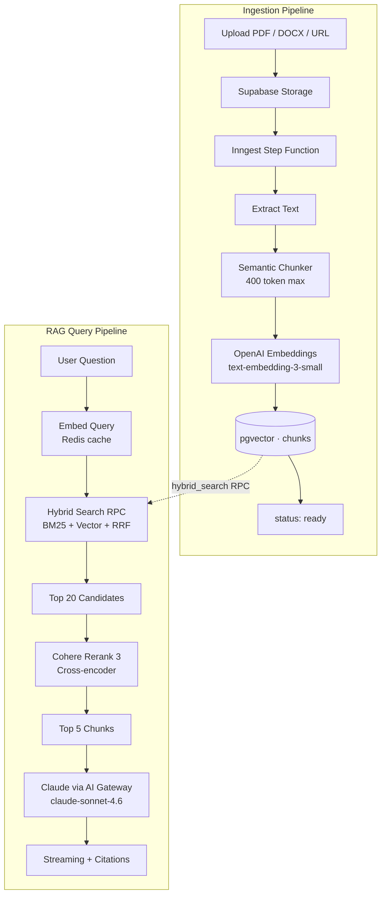
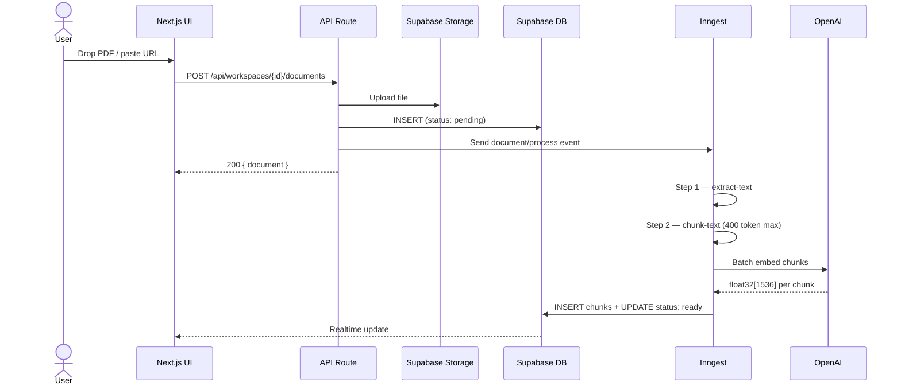
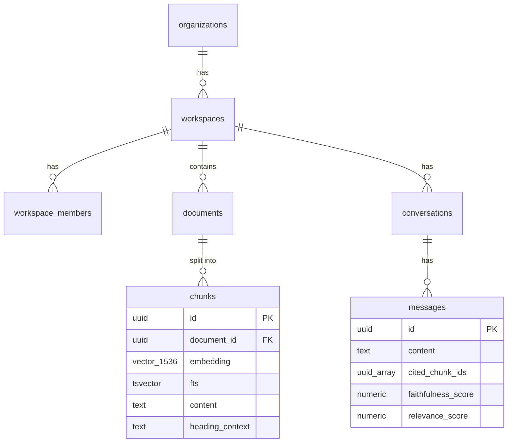

# KnowledgeBase AI


> Your team spends hours searching SharePoint, Notion, and email threads for answers that already exist in your documents.
>
> **KnowledgeBase AI gives every employee instant, cited answers from your internal knowledge — in under 2 seconds, with full audit trail, and zero data leaving your infrastructure.**

---

## What It Does

| | Before | After |
|---|---|---|
| Find a policy answer | 15–30 min search + email thread | 2 seconds, cited answer |
| Onboard a new hire | 40 hrs reading docs + Q&A | Day-1 chat access to all documents |
| Repeated questions | Same question, different person, every week | Self-serve, zero repeat tickets |
| Compliance audit | Manual document trail | Exported conversation + citation log |

**Cost:** ~$0.003/query × 300 queries/day = **$0.90/day** ($27/month) — vs. 75 hrs/week of recovered search time at $50/hr blended rate.

---

## Screenshots

| Chat with Citations | Document Manager | Analytics Dashboard |
|---|---|---|
|  |  |  |

---

## Architecture



---

## Ingestion Pipeline



---

## Database Schema



---

## What Makes This Enterprise-Level

### Tier 1 — Search Quality
- **Hybrid BM25 + vector search** with Reciprocal Rank Fusion — catches both semantic and keyword matches that either alone would miss
- **Cross-encoder reranking** (Cohere Rerank 3) — re-orders top 20 candidates by true semantic relevance, not just cosine distance
- **Semantic chunking** — paragraph-boundary aware, 400 token max, preserves `heading_context` for each chunk

### Tier 2 — User Experience
- **Streaming with inline citation badges** — `[1]`, `[2]` appear as content streams; HoverCard shows source + page + confidence %
- **Real-time document processing** — `pending → processing → ready` via Supabase Realtime
- **Async RAG evaluation** — faithfulness + relevance scores shown below each assistant response (Claude Haiku, fire-and-forget via Inngest)
- **Conversation export to PDF** — audit trail with cited document names per message (`@react-pdf/renderer`)

### Tier 3 — Enterprise Credibility
- **Multi-tenant workspaces** — Supabase RLS enforces tenant isolation at the database layer; workspaces cannot read each other's data
- **RBAC** — owner / editor / viewer roles per workspace; checked on every API route
- **Workspace system prompt** — owners customize the assistant persona per workspace
- **Analytics dashboard** — queries/day chart, top cited documents, avg latency, 7-day cost (Recharts + TanStack Query)
- **Soft deletes** — documents are never hard-deleted; 30-day purge via Inngest nightly cron

---

## Stack

| Layer | Technology |
|---|---|
| Framework | Next.js 16 App Router + React 19 + TypeScript strict |
| Styling | Tailwind v4 + shadcn/ui (new-york) |
| AI Generation | Claude `claude-sonnet-4.6` via Vercel AI Gateway (OIDC auth) |
| Embeddings | OpenAI `text-embedding-3-small` (1536d) — direct fetch, Redis-cached |
| Reranking | Cohere Rerank 3 — cross-encoder, graceful fallback to RRF order |
| Database | Supabase PostgreSQL + pgvector (HNSW index, m=16) |
| File Storage | Supabase Storage |
| Background Jobs | Inngest v4 step functions (retries, concurrency control) |
| Rate Limiting | Upstash Redis + `@upstash/ratelimit` (sliding window) |
| Charts | Recharts + TanStack Query |
| PDF Export | `@react-pdf/renderer` v4 |
| Error Monitoring | Sentry (`src/instrumentation.ts`) |

---

## Security & Privacy

- **Your data stays in your infrastructure** — documents stored in Supabase (your account, your region)
- **Zero training on your data** — Claude API contract prohibits using API calls for model training
- **Row-Level Security** — database-enforced tenant isolation at the Postgres layer
- **RBAC** — owner / editor / viewer roles per workspace, enforced on every mutation
- **Audit log** — every query logged with user ID, timestamp, latency, and token cost in `query_events`
- **SSRF protection** — URL ingestion blocks private IP ranges (`169.254.x.x`, `10.x.x.x`, etc.) via `ssrf-req-filter`
- **Prompt injection defense** — chunk content sanitized before insertion into Claude's context window
- **Rate limiting** — 20 chat requests/user/min + 10 uploads/user/10min with `Retry-After` headers

---

## Quick Start

See [SETUP.md](SETUP.md) for the complete 10-command bootstrap.

```bash
git clone https://github.com/your-username/rag-knowledge-base
cd rag-knowledge-base
vercel link && vercel env pull .env.local
npx supabase db push
npm run db:seed
npm run dev
```

---

## Generating Visual Assets

All documentation visuals are reproducible from source:

```bash
npm run generate:all
# Outputs:
#   docs/architecture.svg        (Mermaid CLI, dark theme)
#   docs/ingestion.svg
#   docs/schema.svg
#   docs/hero.png                (Gemini Imagen 4.0 — requires GEMINI_API_KEY)
#   docs/chat-interface.png      (Playwright screenshot)
#   docs/document-manager.png
#   docs/analytics-dashboard.png
```

---

## Project Structure

```
src/
├── app/
│   ├── (auth)/login/                 # Magic Link auth
│   ├── (app)/workspaces/[id]/
│   │   ├── chat/                     # RAG chat interface
│   │   ├── documents/                # Document manager + Realtime status
│   │   ├── analytics/                # Usage analytics dashboard
│   │   └── settings/                 # Workspace settings + member management
│   └── api/workspaces/[id]/
│       ├── chat/                     # Streaming RAG endpoint
│       ├── documents/                # Upload + soft delete
│       ├── analytics/                # Query analytics
│       ├── members/                  # RBAC invite/remove
│       ├── conversations/[id]/export # PDF conversation export
│       └── health/                   # Unauthenticated health check
├── lib/
│   ├── rag/                          # search, rerank, chunker, embedder, prompts
│   ├── inngest/functions/            # process-document, evaluate-response
│   ├── analytics/                    # trackQueryEvent, getAnalytics
│   ├── pdf/                          # @react-pdf/renderer template
│   ├── validation/                   # Zod schemas per domain
│   ├── config.ts                     # All magic numbers centralized
│   └── errors.ts                     # Typed error classes
└── components/
    ├── chat/                         # ChatInterface, MessageBubble, CitationBadge
    ├── documents/                    # DocumentManager, UploadZone, DocumentList
    ├── analytics/                    # AnalyticsDashboard, QueriesChart, KpiCard
    └── settings/                     # SettingsForm, MembersTable
```

---

## License

MIT — see [LICENSE](LICENSE).
