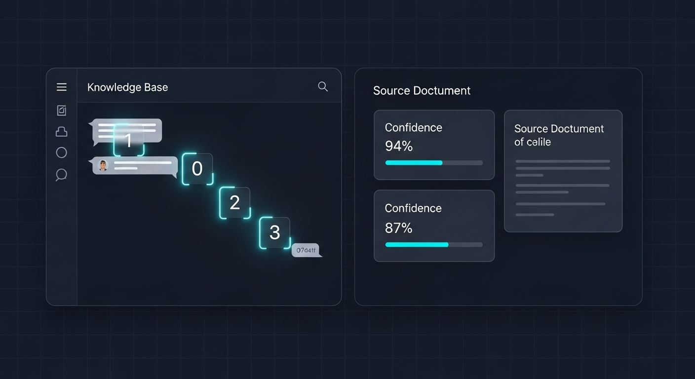
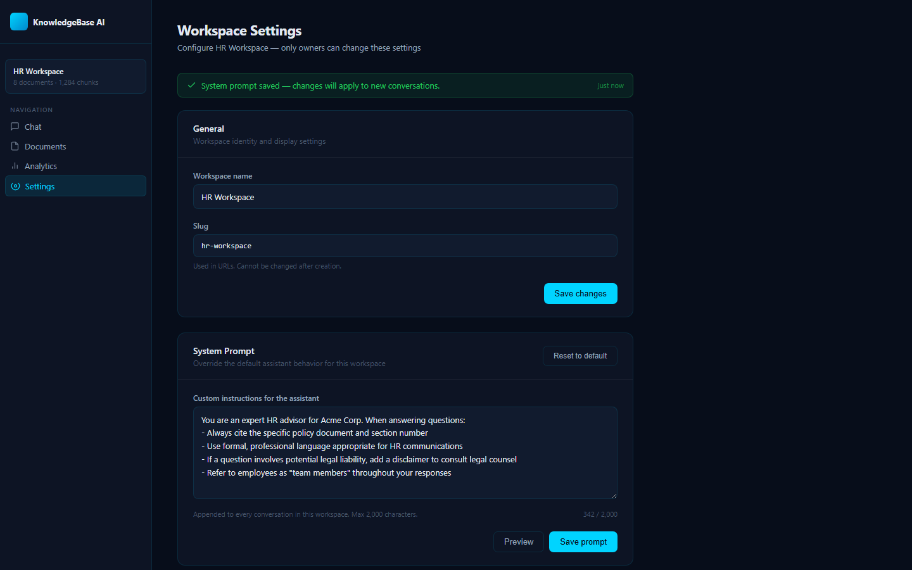
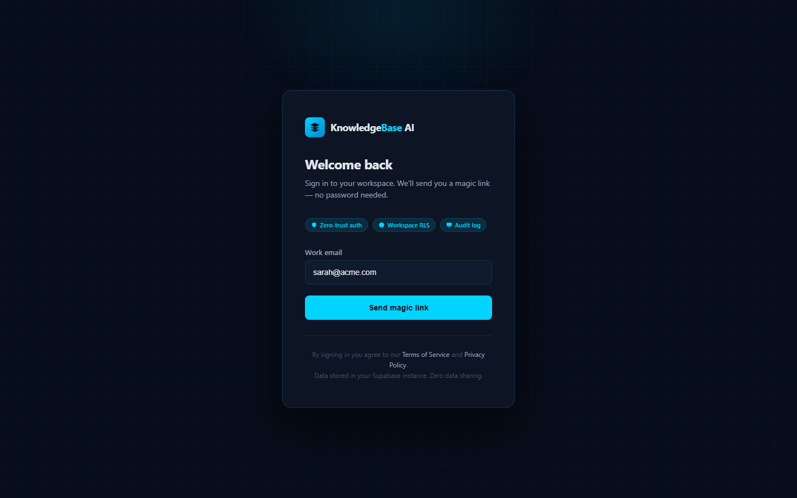
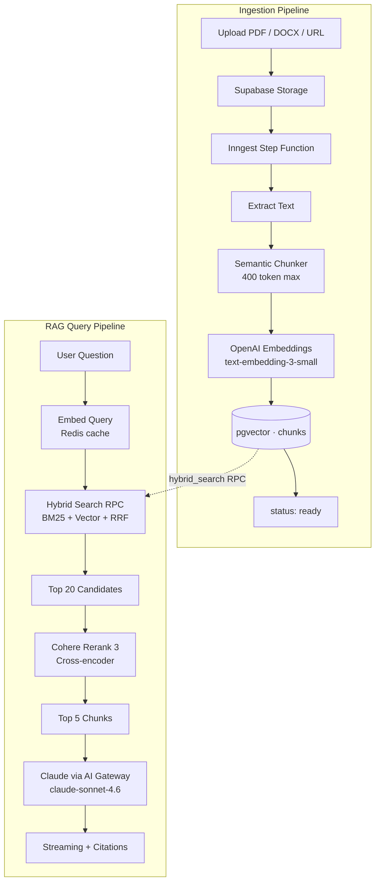
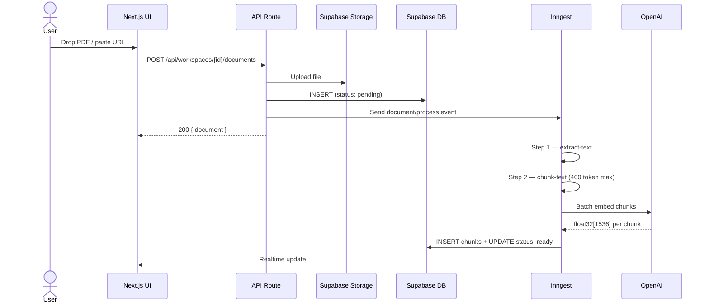
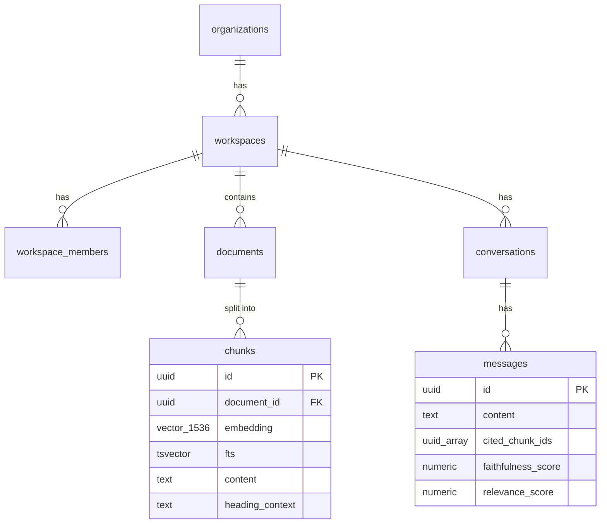

# KnowledgeBase AI


> Your team spends hours searching SharePoint, Notion, and email threads for answers that already exist in your documents.
>
> **KnowledgeBase AI gives every employee instant, cited answers from your internal knowledge — in under 2 seconds, with full audit trail, and zero data leaving your infrastructure.**

---

## The Problem It Solves

| | Before | After |
|---|---|---|
| Find a policy answer | 15–30 min search + email thread | 2 seconds, cited answer |
| Onboard a new hire | 40 hrs reading docs + Q&A | Day-1 chat access to all documents |
| Repeated questions | Same question, different person, every week | Self-serve, zero repeat tickets |
| Compliance audit | Manual document trail | Exported conversation + citation log |

**ROI:** 100 employees × 3 knowledge questions/day × 15 min average search time = **75 hours/week recovered**.
At $50/hr blended rate → **$195,000/year** in reclaimed productivity.
KnowledgeBase AI cost: ~$0.003/query × 300 queries/day = **$27/month**.

---

## Screenshots

<table>
<tr>
  <td align="center"><strong>AI Chat with Inline Citations</strong></td>
  <td align="center"><strong>Document Manager</strong></td>
</tr>
<tr>
  <td></td>
  <td></td>
</tr>
<tr>
  <td align="center"><strong>Analytics Dashboard</strong></td>
  <td align="center"><strong>Workspace Settings &amp; RBAC</strong></td>
</tr>
<tr>
  <td></td>
  <td></td>
</tr>
<tr>
  <td align="center" colspan="2"><strong>Login — Magic Link Auth</strong></td>
</tr>
<tr>
  <td colspan="2" align="center"></td>
</tr>
</table>

---

## Architecture



---

## Ingestion Pipeline



---

## Database Schema



---

## Key Features

### Search That Actually Works
Most RAG tutorials use pure vector similarity. This uses three layers:

1. **Hybrid BM25 + vector search** — a single Postgres RPC fuses keyword matches (BM25) and semantic matches (cosine) via Reciprocal Rank Fusion. A query like "FMLA leave policy section 4" returns the exact policy section even if the embedding distance is mediocre.
2. **Cross-encoder reranking (Cohere Rerank 3)** — the top 20 candidates are re-scored by a model that reads both the query and the document together, not just their embeddings independently. This is the difference between a retrieval system and a good one.
3. **Semantic chunking** — chunks preserve `heading_context` from the nearest preceding heading, so the model always knows what section a chunk belongs to even without surrounding text.

### Inline Citations with Confidence Scores
Every `[1]`, `[2]`, `[3]` in the streaming response is a live citation badge. Hover to see the source document name, page number, heading context, and Cohere confidence score. A sliding sources panel shows all citations for the current message side by side.

### Async RAG Evaluation
After every response, an Inngest step function fires a second Claude call (Haiku, not Sonnet — cheap) that scores the response on two dimensions: **faithfulness** (is every claim grounded in the retrieved context?) and **relevance** (does the answer actually address the question?). Scores appear as color-coded badges below assistant messages.

### Enterprise Isolation
Each workspace is a hard boundary at the Postgres layer. Supabase RLS policies prevent any query from crossing workspace boundaries — even if application code has a bug. Tested by attempting direct REST calls across user accounts.

### Full Audit Trail
Every query is recorded in `query_events` with: user ID, workspace, retrieved chunk IDs, reranked chunk IDs, response token count, cost in USD, and latency. Conversations can be exported to PDF with citations intact — useful for compliance, onboarding audits, and knowledge handoffs.

---

## What Makes This Enterprise-Level

### Tier 1 — Search Quality
- **Hybrid BM25 + vector search** with Reciprocal Rank Fusion — catches both semantic and keyword matches that either alone would miss
- **Cross-encoder reranking** (Cohere Rerank 3) — re-orders top 20 candidates by true semantic relevance, not just cosine distance
- **Semantic chunking** — paragraph-boundary aware, 400 token max, preserves `heading_context` for each chunk

### Tier 2 — User Experience
- **Streaming with inline citation badges** — `[1]`, `[2]` appear as content streams; HoverCard shows source + page + confidence %
- **Real-time document processing** — `pending → processing → ready` via Supabase Realtime
- **Async RAG evaluation** — faithfulness + relevance scores shown below each assistant response (Claude Haiku, fire-and-forget via Inngest)
- **Conversation export to PDF** — audit trail with cited document names per message (`@react-pdf/renderer`)

### Tier 3 — Enterprise Credibility
- **Multi-tenant workspaces** — Supabase RLS enforces tenant isolation at the database layer; workspaces cannot read each other's data
- **RBAC** — owner / editor / viewer roles per workspace; checked on every API route
- **Workspace system prompt** — owners customize the assistant persona per workspace
- **Analytics dashboard** — queries/day chart, top cited documents, avg latency, 7-day cost (Recharts + TanStack Query)
- **Soft deletes** — documents are never hard-deleted; 30-day purge via Inngest nightly cron

---

## Stack

| Layer | Technology | Why |
|---|---|---|
| Framework | Next.js 16 App Router + React 19 + TypeScript strict | App Router co-locates streaming API routes with UI; `noUncheckedIndexedAccess` catches RAG array bugs at compile time |
| Styling | Tailwind v4 + shadcn/ui (new-york) | shadcn gives copy-owned components — no version conflicts with Radix upgrades |
| AI Generation | Claude `claude-sonnet-4.6` via Vercel AI Gateway (OIDC auth) | Gateway adds <20ms routing overhead but gives provider failover, per-user cost attribution, and zero API key rotation |
| Embeddings | OpenAI `text-embedding-3-small` (1536d) — direct fetch, Redis-cached | Best cost/quality ratio for RAG; SHA-256 Redis cache eliminates redundant embedding calls on repeated queries |
| Reranking | Cohere Rerank 3 — cross-encoder, graceful fallback to RRF order | Cross-encoders see the full (query, document) pair simultaneously — fundamentally more accurate than bi-encoder similarity |
| Database | Supabase PostgreSQL + pgvector (HNSW index, m=16) | Single service handles relational data, vector search, file storage, RLS, Realtime, and auth — zero infra sprawl |
| Background Jobs | Inngest v4 step functions | Idempotent retries per step, not per job — a failed embed step doesn't re-extract or re-chunk |
| Rate Limiting | Upstash Redis + `@upstash/ratelimit` (sliding window) | Serverless-native; shares the same Redis instance as embedding cache |
| Charts | Recharts + TanStack Query | Lazy-loaded via `next/dynamic` — ~450KB deferred until first analytics visit |
| PDF Export | `@react-pdf/renderer` v4 | Declarative React components render to PDF server-side; no headless browser required |
| Error Monitoring | Sentry (`src/instrumentation.ts`) | Next.js 16 instrumentation hook captures both server and client errors in one DSN |

---

## Security & Privacy

- **Your data stays in your infrastructure** — documents stored in Supabase (your account, your region)
- **Zero training on your data** — Claude API contract prohibits using API calls for model training
- **Row-Level Security** — database-enforced tenant isolation at the Postgres layer
- **RBAC** — owner / editor / viewer roles per workspace, enforced on every mutation
- **Audit log** — every query logged with user ID, timestamp, latency, and token cost in `query_events`
- **SSRF protection** — URL ingestion resolves hostnames via DNS and blocks all private IP ranges (`169.254.x.x`, `10.x.x.x`, `172.16-31.x.x`, `192.168.x.x`, IPv6 link-local) before any network request is made (`src/lib/rag/extractors/ssrf.ts`)
- **Prompt injection defense** — chunk content sanitized before insertion into Claude's context window; injection phrases replaced with `[redacted]`
- **Rate limiting** — 20 chat requests/user/min + 100 requests/IP/min + 10 uploads/user/10min with `Retry-After` headers
- **Security headers** — CSP, X-Frame-Options, X-Content-Type-Options, Referrer-Policy, Permissions-Policy configured in `next.config.ts`

---

## Quick Start

See [SETUP.md](SETUP.md) for the complete 10-command bootstrap.

```bash
git clone https://github.com/your-username/rag-knowledge-base
cd rag-knowledge-base
vercel link && vercel env pull .env.local
npx supabase db push
npm run db:seed
npm run dev
```

**Prerequisites:** Node.js 20+, a Vercel project, Supabase project, OpenAI API key (embeddings), Cohere API key (reranking).

---

## Generating Visual Assets

All documentation visuals are reproducible from source. No running app or live API required for the screenshots:

```bash
npm run generate:all
# Outputs:
#   docs/architecture.svg        (Mermaid CLI, dark theme)
#   docs/ingestion.svg
#   docs/schema.svg
#   docs/hero.png                (Gemini Imagen 4.0 — requires GEMINI_API_KEY)
#   docs/chat-interface.png      (Playwright screenshot, no running app)
#   docs/document-manager.png
#   docs/analytics-dashboard.png
#   docs/login-page.png
#   docs/workspace-settings.png
```

---

## Project Structure

```
src/
├── app/
│   ├── (auth)/login/                 # Magic Link auth
│   ├── (app)/workspaces/[id]/
│   │   ├── chat/                     # RAG chat interface
│   │   ├── documents/                # Document manager + Realtime status
│   │   ├── analytics/                # Usage analytics dashboard
│   │   └── settings/                 # Workspace settings + member management
│   └── api/workspaces/[id]/
│       ├── chat/                     # Streaming RAG endpoint
│       ├── documents/                # Upload + soft delete
│       ├── analytics/                # Query analytics
│       ├── members/                  # RBAC invite/remove
│       ├── conversations/[id]/export # PDF conversation export
│       └── health/                   # Unauthenticated health check
├── lib/
│   ├── rag/                          # search, rerank, chunker, embedder, prompts
│   ├── inngest/functions/            # process-document, evaluate-response
│   ├── analytics/                    # trackQueryEvent, getAnalytics
│   ├── pdf/                          # @react-pdf/renderer template
│   ├── validation/                   # Zod schemas per domain
│   ├── config.ts                     # All magic numbers centralized
│   └── errors.ts                     # Typed error classes
└── components/
    ├── chat/                         # ChatInterface, MessageBubble, CitationBadge
    ├── documents/                    # DocumentManager, UploadZone, DocumentList
    ├── analytics/                    # AnalyticsDashboard, QueriesChart, KpiCard
    └── settings/                     # SettingsForm, MembersTable
```

---

## FAQ

**Can I use this with my existing documents without re-uploading everything?**
Not directly — documents must be processed through the ingestion pipeline to generate embeddings and chunks. You can automate bulk ingestion via the API route if you have many files. See `scripts/seed-demo-docs.ts` for the pattern.

**Why Cohere Rerank and not just more vector search results?**
Vector similarity measures how close two embeddings are — it doesn't model the relationship between a query and a document. Cross-encoders (what Cohere Rerank uses) read both texts together and produce a relevance score. In practice, the top-ranked vector result is often not the most relevant chunk when the query is keyword-heavy or domain-specific. Reranking typically improves answer quality measurably on document-heavy knowledge bases.

**What document types are supported?**
PDF, DOCX, TXT, MD, and any public URL (web scraping via Cheerio). File size limit: 20MB. URLs are SSRF-filtered before fetch.

**Does this work without Cohere?**
Yes — if Cohere reranking fails (rate limit, bad key, API down), the system falls back gracefully to the raw RRF order from the hybrid search. You'll get slightly lower answer quality but the system stays live.

**Can I deploy this without Vercel?**
The AI Gateway integration uses Vercel OIDC for authentication, which requires a Vercel project. You can replace `gateway('anthropic/claude-sonnet-4.6')` with `createAnthropic()('claude-sonnet-4-6')` and remove the gateway dependency, then deploy anywhere Node.js runs.

**Is there a hosted demo?**
No. This is a portfolio/reference project. Deploy it to your own infrastructure following [SETUP.md](SETUP.md).

---

## Contributing

See [CONTRIBUTING.md](CONTRIBUTING.md) for development setup and contribution guidelines.

---

## License

MIT — see [LICENSE](LICENSE).
